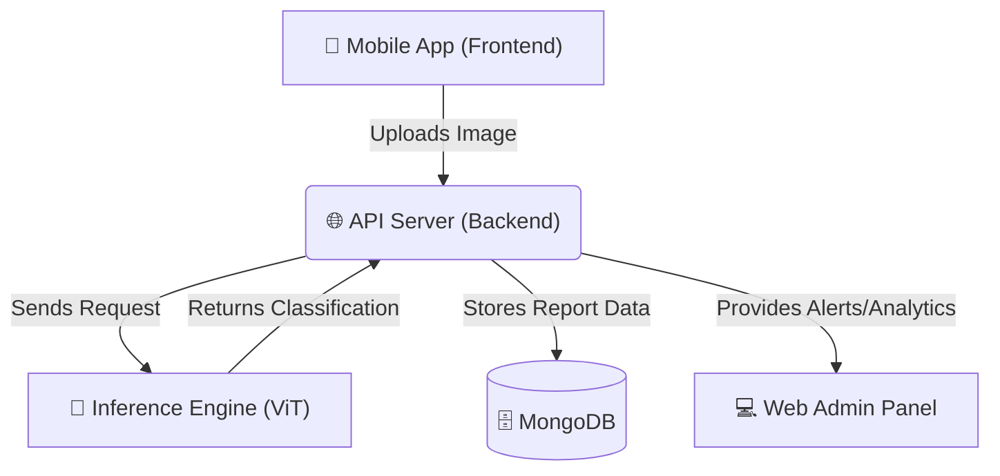

# 🛣️ SafeStreet – Road Damage Detection & Alert System

**SafeStreet** is an AI-powered ecosystem designed to detect various types of road damage from real-world images using a Vision Transformer (ViT) model. The primary goal is to assist civic bodies and citizens by actively monitoring, detecting, and alerting about dangerous road conditions through an integrated mobile and web platform.

## 🌟 Project Overview

SafeStreet processes road images and automatically detects and classifies damages into 4 distinct categories:
- **Crack**
- **Pothole**
- **Patch**
- **Surface**

Alerts and geographic data are sent to a centralized backend, allowing administrators to monitor reports seamlessly on a web dashboard, while field users contribute data and visualize results through a mobile app.

## 🏗️ Architecture & Project Structure

The project is highly modular and broken down into four main components:



- **`/inference` (AI Model)**: Contains the PyTorch Vision Transformer (ViT) model for classifying road damages, as well as the Python script (`app.py`) for serving predictions.
- **`/backend` (API Server)**: A Node.js + Express API that processes user image uploads, interfaces with the inference module, stores user/report metadata in the database, and serves the frontend apps.
- **`/frontend` (Mobile App)**: A React Native + Expo mobile application for field users to capture/upload road damage pictures and visualize results.
- **`/web` (Admin Panel)**: A React.js web dashboard intended for civic body administrators to track reports, view analytics, and proactively respond to infrastructure issues.

## 🛠️ Technologies Used

- **Model Pipeline:** Vision Transformer (ViT), PyTorch, Python
- **Frontend (Mobile):** React Native, Expo Go
- **Frontend (Web):** React.js
- **Backend Services:** Node.js, Express.js
- **Database Architecture:** MongoDB
- **Data Source:** Custom-labeled road damage image dataset

## 🚀 Getting Started

To run the full stack locally, you need to initialize each individual component. Please follow the instructions below (more detailed guides are available in each directory's `README.md`).

### 1. API Backend
```bash
cd backend
npm install
# Ensure you have your .env file configured
npm start
```

### 2. Start Inference Server (AI)
Make sure you have Python 3 and pip installed.
```bash
cd inference
pip install -r requirements.txt
python app.py
```

### 3. Mobile App (Citizen Facing)
```bash
cd frontend
npm install
npx expo start
```

### 4. Web Admin Panel (Civic Operations)
```bash
cd web
npm install
npm start
```

## 🤝 Contributing
Contributions are welcome! Whether you are improving the machine learning model's accuracy, optimizing backend integrations, or enhancing the frontend UI experience—please feel free to submit a pull request!
